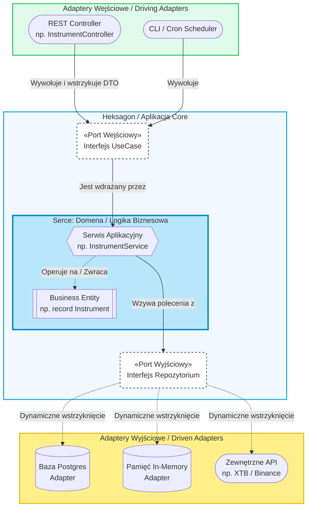

# Lekcja 04: Architektura Heksagonalna (Ports & Adapters)

> 📖 Diagram heksagonu i package structure: [`docs/theory/06-architecture.md`](../../../docs/theory/06-architecture.md), sekcja 4.



## Główna Idea

**"Domena nie zależy od NICZEGO. Infrastruktura zależy od Domeny."**

W centrum stoi Twoja logika biznesowa (Serwisy, Encje). Baza danych, HTTP, AI — to wszystko jest na zewnątrz. Komunikacja przebiega przez:

### Porty (interfejsy w Domenie)

1. **Port IN (Driving)** — co domena **oferuje** światu. Use Case'y wywoływane z zewnątrz.
   - Przykład: interfejs `ManageInstrumentsUseCase` z metodami `create()`, `findById()`
   - Adapter IN (Controller REST) woła ten port

2. **Port OUT (Driven)** — czego domena **potrzebuje** od infrastruktury, ale nie mówi JAK.
   - Przykład: interfejs `InstrumentRepository` z metodą `findById()`
   - Adapter OUT (InMemory, JPA) implementuje ten port

### Adaptery (implementacje na zewnątrz)

- **Adapter IN** = Controller REST (przyjmuje żądania HTTP, woła Port IN)
- **Adapter OUT** = InMemoryInstrumentRepository, JpaInstrumentRepository (implementuje Port OUT)

### Dependency Rule

```
Controller → [Port IN interface] ← Service (implements) → [Port OUT interface] ← InMemoryRepo (implements)
```

Strzałki zależności wskazują **DO ŚRODKA** — do interfejsów w Domenie.

---

## Aktualny problem w Wallet Manager

Teraz Twój `InstrumentService` wygląda tak:

```java
@Service
public class InstrumentService {
    private final InMemoryInstrumentRepository inMemoryInstrumentRepository; // ← KONKRETNA KLASA!
}
```

Serwis zna **implementację**. Gdybyś chciał podmienić InMemory na JPA (Module 05), musiałbyś zmienić Serwis. To łamie Dependency Rule.

## Jak powinno wyglądać

```java
// Port OUT (interfejs w domenie)
public interface InstrumentRepository {
    Instrument save(Instrument instrument);
    Optional<Instrument> findById(Long id);
    List<Instrument> findAll();
    void deleteById(Long id);
}

// Adapter OUT (implementacja)
@Repository
public class InMemoryInstrumentRepository implements InstrumentRepository { ... }

// Serwis woła interfejs — nie zna implementacji
@Service
public class InstrumentService {
    private final InstrumentRepository instrumentRepository; // ← INTERFEJS!
}
```

W Module 05 stworzysz `JpaInstrumentRepository implements InstrumentRepository` — i **ani linijki w Service nie zmienisz**.

---

## 🏋️ Zadanie: Wydzielenie Portu OUT (Repository Interface)

To najważniejsze zadanie tego modułu. Jest wprost na liście w `PROJECT.md`:

> _"Wydzielenie interfejsów InstrumentRepository / TransactionRepository"_

### Krok po kroku:

1. **Stwórz interfejs** `InstrumentRepository.java` w `instrument/`:

   ```java
   public interface InstrumentRepository {
       Instrument save(Instrument instrument);
       Optional<Instrument> findById(Long id);
       List<Instrument> findAll();
       void deleteById(Long id);
       Instrument update(Long id, Instrument instrument);
       List<Instrument> findByCriteria(String type, String currency, String ticker, String market);
   }
   ```

2. **Zaimplementuj interfejs** w `InMemoryInstrumentRepository`:

   ```java
   @Repository
   public class InMemoryInstrumentRepository implements InstrumentRepository { ... }
   ```

3. **Zmień `InstrumentService`** — zamień typ pola z `InMemoryInstrumentRepository` na `InstrumentRepository`.

4. **Powtórz** analogicznie dla `TransactionRepository` + `InMemoryTransactionRepository` + `TransactionService`.

5. **Zbuduj projekt** (`./mvnw clean install`) i sprawdź, czy testy przechodzą.

> 💡 Po tym zadaniu: dodanie JPA w Module 05 to kwestia stworzenia nowej klasy `JpaInstrumentRepository implements InstrumentRepository` — zero zmian w Service!

## Sprawdzian wiedzy

- [x] Rozumiem główną ideę: Domena w centrum, niezależna od infrastruktury
- [x] Wiem, czym różni się Port IN (Use Case) od Portu OUT (Repository Interface)
- [x] Zrozumiałem, dlaczego adaptery implementują porty zdefiniowane w domenie
- [x] Wydzieliłem interfejsy `InstrumentRepository` i `TransactionRepository` w kodzie
- [x] Zastąpiłem wstrzykiwanie konkretnych klas repozytoriów na ich interfejsy w serwisach
