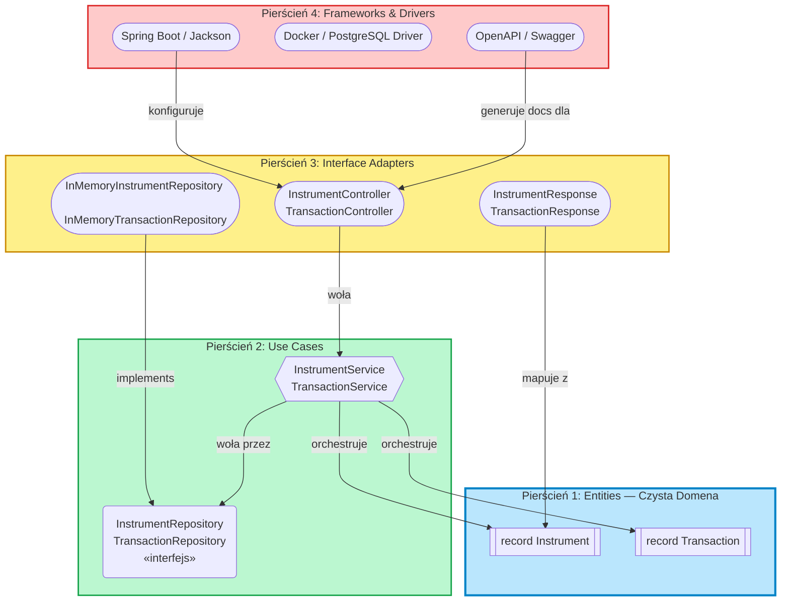

# Lekcja 05: Clean Architecture

> 📖 Diagram pierścieni i porównanie z Hexagonal: [`docs/theory/06-architecture.md`](../../../docs/theory/06-architecture.md), sekcja 5.

Clean Architecture (Bob Martin) to ta sama obietnica co Hexagonal — izolacja domeny od infrastruktury — ale przedstawiona jako **koncentryczne pierścienie**:

## 4 Pierścienie (od środka)

1. **Entities** 🔵 — czyste zasady biznesowe. `Instrument`, `Transaction`. Nie zależą od Springa, bazy, niczego.
2. **Use Cases** 🟢 — orchestracja. `InstrumentService.createInstrument()`. Woła Entities i Porty.
3. **Interface Adapters** 🟡 — konwersja formatów. Kontrolery REST, DTO, implementacje repozytoriów.
4. **Frameworks & Drivers** 🔴 — Spring Boot, Jackson JSON, drivery SQL, Docker, Swagger.

**Dependency Rule:** Zależności idą tylko DO ŚRODKA. Warstwa 4 zna 3, ale 1 nie wie nic o istnieniu 2, 3, 4.

### Różnica od Hexagonal

W praktyce — minimalna. Hexagonal mówi językiem "Portów i Adapterów", Clean mówi "Pierścieniami". Koncepcja ta sama: **domena w centrum, infrastruktura na zewnątrz.**

---

## 🏋️ Zadanie: Mapowanie klas Wallet Manager na pierścienie

Wypełnij tabelę — do którego pierścienia należy każda klasa z Twojego projektu?

| Klasa                               | Pierścień (1-4) | Uzasadnienie |
| ----------------------------------- | --------------- | ------------ |
| `Instrument.java` (record)          | 1               |              |
| `Transaction.java` (record)         | 1               |              |
| `InstrumentService.java`            | 2               |              |
| `TransactionService.java`           | 2               |              |
| `InstrumentController.java`         | 3               |              |
| `InMemoryInstrumentRepository.java` | 3               |              |
| `InstrumentResponse.java` (DTO)     | 3               |              |
| `OpenApiConfig.java`                | 4               |              |
| `WalletApplication.java`            | 4               |              |

Pytania pomocnicze:

1. Czy `Instrument.java` importuje cokolwiek ze Springa? Jeśli tak — to **nie jest** czysta Entity pierścienia 1. (Sprawdź adnotację `@Schema` od Swagger — czy to framework czy domena?)
2. Gdzie umieścisz interfejs `InstrumentRepository` (stworzony w Lekcji 04)?

## Sprawdzian wiedzy

- [x] Znam 4 pierścienie Clean Architecture
- [x] Rozumiem, że zależności mogą iść tylko do środka (Dependency Rule)
- [x] Potrafię przypisać klasy z Wallet Manager do odpowiednich pierścieni
- [x] Zidentyfikowałem miejsca, w których model domenowy może być "skażony" frameworkiem (np. `@Schema`)
